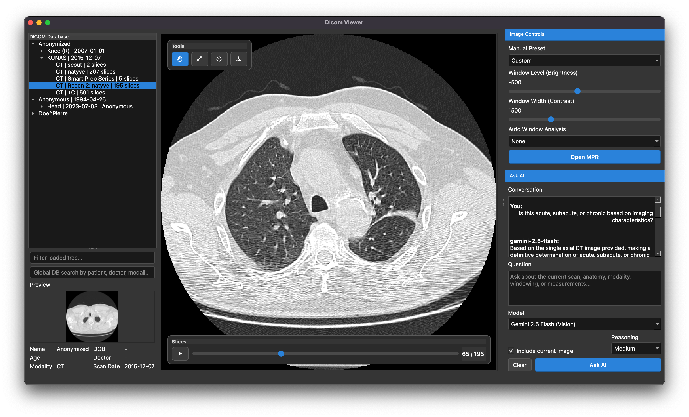
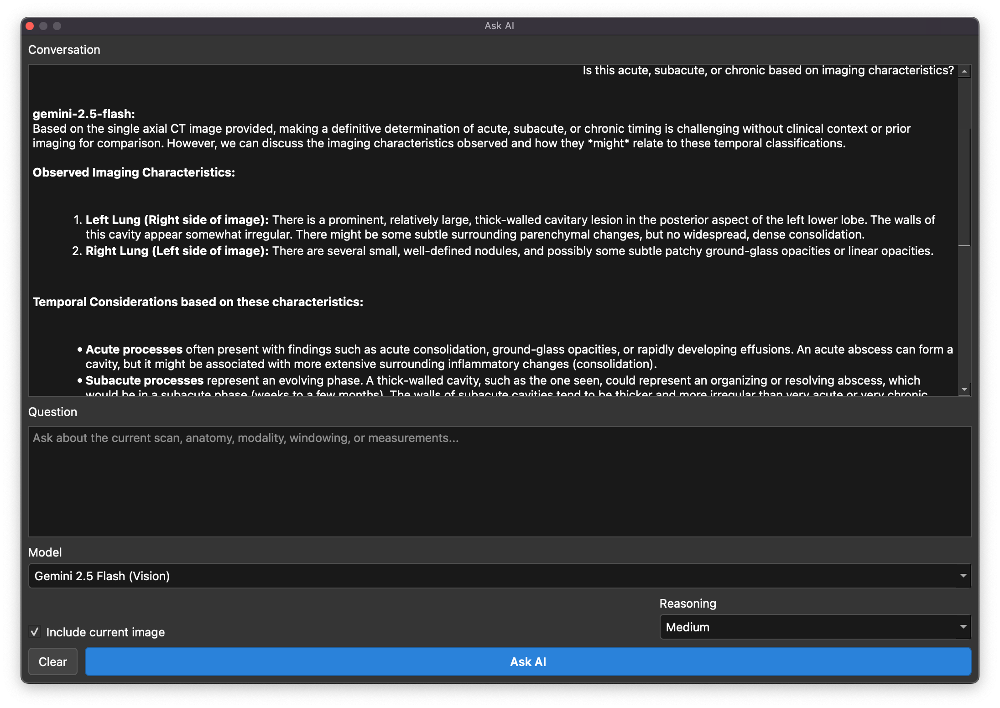
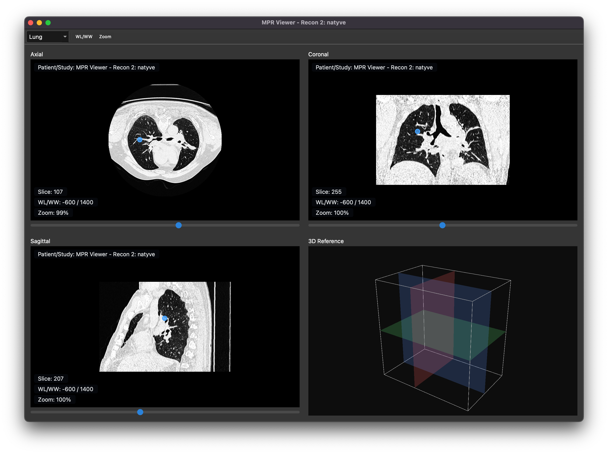

# DicomViewer

`DicomViewer` is a `Qt 6` / `C++20` desktop application for browsing and viewing DICOM studies with PostgreSQL-backed hierarchy indexing, a VTK-based main viewer, VTK-based MPR, and an optional AI assistant. The current codebase is a professional-grade desktop viewer foundation aimed at scaling to larger datasets and richer clinical-style workflows.

## Features

- DICOM import with `GDCM`
- raw grayscale rendering with true `WL/WW`
- slice scrolling and cine playback
- VTK MPR viewer with synchronized axial / coronal / sagittal panes and a 3D reference pane
- VTK 3D rendered (on progress)
- optional AI Q&A dock with user-provided API key

## Screenshots

### Main Viewer



### AI Assistant



### MPR Viewer



## Clone

```bash
git clone https://github.com/Gokulakrishh/DicomViewer.git
cd DicomViewer
```

## Requirements

You need:

- `CMake >= 3.21`
- `Qt 6`
- `VTK` with Qt 6 support (I built VTK with Qt-6)
- `GDCM`
- `OpenCV >= 4.6` (not used so far)
- PostgreSQL client libraries
- Qt `QPSQL` plugin for runtime DB access
- a running PostgreSQL database

## Build On A New Machine

### 1. Configure PostgreSQL

Create a database and make sure the user has access.

Example `config.ini`:

```ini
[database]
hostName=127.0.0.1
port=5432
databaseName=dicomviewer
userName=postgres
password=your_password

[ai]
provider=gemini
baseUrl=https://generativelanguage.googleapis.com
apiKey=
model=gemini-2.5-flash
defaultReasoningLevel=medium
requestTimeoutMs=30000
maxOutputTokens=2048
```

If you do not want AI, leave:

```ini
provider=none
apiKey=
```

### 2. Build

```bash
cmake -S . -B build -DCMAKE_PREFIX_PATH=/path/to/Qt/6.x.x
cmake --build build -j4
```

## First Run

After launch:

1. Open a DICOM folder.
2. Let the app import the folder into PostgreSQL.
3. Browse patients, studies, and series from the left tree.
4. Select a series to load it into the VTK main viewer.
5. Use `View -> Open MPR` for VTK-based multi-planar reconstruction on multi-slice series.
5. Use `View -> 3D` for VTK-based 3D reconstruction of bone or lung series.
