# 3D Class Diagram and SOLID Design

## Purpose

This document defines a class-level architecture for the 3D pipeline with a strong focus on:

- `SOLID` principles
- `C++20` concepts and type constraints
- disciplined use of templates
- strategy-based preprocessing and segmentation
- future extensibility for different anatomy targets such as:
  - brain
  - lung
  - bone
  - other organs

The goal is to avoid a monolithic `if modality == ...` or `if organ == ...` implementation.

Instead, the system should allow:

- different segmentation strategies
- different preprocessing strategies
- different post-processing strategies
- different presets / workflows

without rewriting the whole pipeline.

## C++20 Design Position

This project should use both:

- runtime polymorphism
- compile-time generic programming

but for different reasons.

### Use runtime polymorphism for

- anatomy-dependent behavior
- algorithm selection
- pipeline composition
- profile selection

Examples:

- `ISegmentationStrategy`
- `IConnectedComponentStrategy`
- `IMeshExtractionStrategy`
- `I3dPipelineProfile`

Reason:

- brain, lung, bone, and organ workflows are behavioral choices made at runtime
- these are policy objects
- this is where SOLID and DIP matter most

### Use templates and concepts for

- numeric voxel type safety
- reusable mask/volume storage
- generic algorithms over scalar type
- compile-time constraints

Examples:

- `VolumeData<TVoxel>`
- `SegmentationMaskData<TMaskVoxel>` if generalized
- generic convolution/interpolation helpers
- mesh attribute math helpers

Reason:

- these are data-shape or numeric-type concerns
- compile-time checks are more appropriate than runtime interface dispatch

So the architecture should be:

- runtime polymorphism for pipeline behavior
- templates/concepts for data representation and numeric operations

This is the cleanest split.

## Design Goals

The design should satisfy:

### Single Responsibility Principle

Each class should have one reason to change.

Examples:

- resampling logic should not live inside segmentation
- segmentation should not know about UI
- mesh extraction should not know about DICOM parsing

### Open / Closed Principle

Adding a new organ workflow should mostly mean:

- add new strategy classes
- add a new pipeline profile

not editing the core orchestrator repeatedly.

### Liskov Substitution Principle

Any segmentation strategy should be usable where a segmentation interface is expected.

### Interface Segregation Principle

Clients should not depend on giant all-in-one interfaces.

### Dependency Inversion Principle

The top-level 3D pipeline should depend on abstractions:

- preprocessing interface
- segmentation interface
- filtering interface
- mesh extraction interface

not concrete algorithm classes.

## Proposed High-Level Architecture

The 3D stack should be organized into layers:

```text
Input / Volume
  -> Preprocessing
  -> Segmentation
  -> Mask Refinement
  -> Mesh Extraction
  -> Mesh Post-Processing
  -> C++ Presentation Bridge
  -> QML 3D Viewer
  -> Rendering / Export
```

Core idea:

- one generic pipeline orchestrator
- multiple interchangeable strategies
- one profile object that chooses the right strategy set
- one thin QML-facing presentation/controller layer for interactive 3D viewing

## QML Design Position

For 3D interaction, the correct split is:

- computation in C++
- presentation in QML

That means:

- volume building stays in C++
- resampling stays in C++
- segmentation stays in C++
- mesh extraction stays in C++
- camera interaction, toolbars, toggles, presets, and scene presentation move to QML

This is the right boundary because:

- 3D algorithms are easier to test in C++
- QML is better for interactive viewport UI
- the pipeline stays reusable for non-QML contexts later

So the final architecture should be:

```text
Pipeline / algorithms
  -> C++ controller / adaptor
  -> QML 3D scene
```

Do **not** move segmentation or marching cubes into QML.

## Core Interfaces

### Volume Domain

```text
IVolumeData
VolumeData<T>
VolumeGeometry
```

These already exist or mostly exist.

### Existing concept direction

The project already has:

- [VolumeConcepts.h](/Users/goku/Documents/DicomViewer/src/Model/VolumeConcepts.h)
- [VolumeData.h](/Users/goku/Documents/DicomViewer/src/Model/VolumeData.h)

This is the correct direction.

The 3D architecture should continue that pattern:

- concept-constrained templates for storage and math
- interface-based strategies for orchestration

### Mesh Domain

Suggested future additions:

```text
IMeshData
MeshData
MeshBuilder
MeshGeometryStats
QmlMeshSceneData
```

Responsibilities:

- hold vertices
- hold triangle indices
- hold normals
- build indexed meshes from extraction output
- provide mesh bounds/statistics
- optionally provide a presentation-ready view model for QML

Implementation note:

- `MeshBuilder` should remain a local accumulation object
- later block/slab parallel extraction should produce one builder per worker and merge results afterward
- do not parallelize by sharing one global mutable builder

### Segmentation Mask Domain

Suggested future additions:

```text
ISegmentationMask
SegmentationMaskData
```

Responsibilities:

- binary voxel mask
- geometry aligned with source volume

### Future Organ Labeling Domain

For later multi-organ workflows, do not overload the binary-mask abstraction.

Suggested future additions:

```text
ILabelVolume
LabelVolumeData<TLabel>
```

Responsibilities:

- multi-label voxel storage
- organ/tissue IDs instead of only foreground/background
- geometry aligned with the source volume

Recommended direction:

- keep `ISegmentationMask` for binary workflows
- add `ILabelVolume` later for organ labeling

That keeps the current binary pipeline valid while making the future organ-label layer possible without rewriting it.

## Core Service Interfaces

Suggested abstractions:

```text
IVolumePreprocessor
ISegmentationStrategy
IMaskRefinementStrategy
IConnectedComponentStrategy
IMeshExtractionStrategy
IMeshPostProcessor
I3dPipelineProfile
IThreeDScenePresenter
```

## QML-Facing Interfaces and Classes

Suggested additions for the presentation layer:

```text
ThreeDViewerController
ThreeDSceneState
MeshSceneAdapter
QmlMeshGeometry
IThreeDScenePresenter
QtQuick3DScenePresenter
```

## QML Layer Responsibilities

### `ThreeDViewerController`

Purpose:

- main UI-facing C++ controller for the QML 3D view

This class should:

- receive a selected `I3dPipelineProfile`
- request mesh generation from `ThreeDimensionalPipelineService`
- expose QML properties and invokable methods
- manage loading state, error state, and selected workflow

It should **not** implement segmentation or mesh extraction directly.

Example responsibilities:

- `loadSeriesFor3d(...)`
- `rebuildMesh()`
- `setProfile(...)`
- `setThresholds(...)`
- `resetCamera()`
- `toggleWireframe()`
- expose:
  - `isBusy`
  - `errorText`
  - `currentProfileName`
  - `meshAvailable`

### `ThreeDSceneState`

Purpose:

- immutable or mostly-value-based state model for the QML viewer

Examples:

- current shading mode
- visibility toggles
- camera reset request state
- selected organ profile
- mesh statistics

This keeps UI state separate from mesh generation logic.

### `MeshSceneAdapter`

Purpose:

- convert `IMeshData` into a form suitable for QML / Qt Quick 3D consumption

Responsibilities:

- flatten vertices / normals / indices into render-ready arrays
- prepare geometry buffers
- keep rendering representation separate from algorithmic mesh representation

This class is important because:

- `IMeshData` is algorithm/domain data
- QML rendering usually needs a graphics-friendly representation

That separation is a good SRP boundary.

### `IThreeDScenePresenter`

Purpose:

- abstract the rendering backend used by the QML layer

Interface idea:

```cpp
class IThreeDScenePresenter
{
public:
    virtual ~IThreeDScenePresenter() = default;
    virtual void setMesh(std::shared_ptr<IMeshData> mesh) = 0;
    virtual void clearMesh() = 0;
};
```

First implementation:

- `QtQuick3DScenePresenter`

This preserves flexibility if later:

- Qt Quick 3D is replaced
- a custom renderer is needed
- export preview rendering differs from interactive rendering

### `QmlMeshGeometry`

Purpose:

- a concrete geometry object exposed to Qt Quick 3D

Possible roles:

- hold vertex buffer
- hold index buffer
- hold normal buffer

This is a rendering object, not a domain object.

It should be constructed from `MeshSceneAdapter`, not from the segmentation pipeline directly.

## Concepts and Template Types

### 1. Voxel concept

At compile time, not every type should be accepted as a volume voxel type.

Suggested concept:

```cpp
template<typename T>
concept VolumeVoxel =
    std::integral<T> || std::floating_point<T>;
```

This allows:

- `int16_t`
- `uint16_t`
- `float`
- `double`

and rejects:

- arbitrary structs
- QString
- unsupported application objects

### 2. Binary mask voxel concept

If masks are later generalized beyond `uint8_t`, use a dedicated concept:

```cpp
template<typename T>
concept MaskVoxel =
    std::same_as<T, uint8_t> ||
    std::same_as<T, bool>;
```

This keeps segmentation-mask storage explicit.

### 3. Mesh scalar concept

For mesh vertex coordinates and normals:

```cpp
template<typename T>
concept MeshScalar = std::floating_point<T>;
```

This avoids integer mesh geometry accidentally compiling.

## Suggested Template Classes

### `VolumeData<TVoxel>`

Already conceptually present.

Recommended role:

- owns scalar voxels
- owns `VolumeGeometry`
- provides indexed access

Example:

```cpp
template<VolumeVoxel TVoxel>
class VolumeData final : public IVolumeData
{
public:
    using voxel_type = TVoxel;
};
```

### `SegmentationMaskData<TMaskVoxel>`

Suggested:

```cpp
template<MaskVoxel TMaskVoxel = uint8_t>
class SegmentationMaskData final : public ISegmentationMask
{
public:
    using voxel_type = TMaskVoxel;
};
```

Why template this at all:

- default can stay `uint8_t`
- but the type remains explicit and reusable

### `MeshData<TScalar>`

Suggested:

```cpp
template<MeshScalar TScalar = float>
class MeshData final : public IMeshData
{
public:
    using scalar_type = TScalar;
};
```

This is useful if later you want:

- `float` meshes for rendering
- `double` meshes for analysis/export

## Suggested Generic Math Types

Prefer small strongly typed math structs over raw nested vectors:

```cpp
template<MeshScalar T>
struct Vec3
{
    T x;
    T y;
    T z;
};
```

and:

```cpp
template<MeshScalar T>
struct Triangle
{
    std::uint32_t i0;
    std::uint32_t i1;
    std::uint32_t i2;
};
```

This makes mesh code easier to debug and test.

## Where Templates Should Stop

Do **not** template everything.

Bad direction:

```cpp
template<typename TPreprocessor,
         typename TSegmentation,
         typename TFilter,
         typename TExtractor>
class ThreeDimensionalPipelineService;
```

Why this is weak here:

- pipeline behavior becomes harder to compose dynamically
- code size grows
- testing becomes noisier
- anatomy selection becomes awkward

This project needs runtime-selectable strategies more than compile-time pipeline assembly.

So:

- data containers: templated
- math utilities: templated
- algorithm policies: interfaces
- top-level orchestration: non-template

That is the correct balance.

The same rule applies to QML integration:

- do not template the viewer controller
- do not template the scene presenter
- keep those runtime-composed and interface-driven

## Class Responsibilities

### 1. `IVolumePreprocessor`

Purpose:

- transform input scalar volume before segmentation

Examples:

- isotropic resampling
- Gaussian smoothing
- intensity normalization

Interface idea:

```cpp
class IVolumePreprocessor
{
public:
    virtual ~IVolumePreprocessor() = default;
    virtual std::shared_ptr<IVolumeData> process(const IVolumeData& input) const = 0;
};
```

### Optional concept-constrained overloads

Some concrete preprocessors may expose typed helpers:

```cpp
template<VolumeVoxel TVoxel>
std::shared_ptr<VolumeData<TVoxel>>
processTyped(const VolumeData<TVoxel>& input) const;
```

Then the interface-level method can adapt through `IVolumeData`.

This is useful when the internal implementation benefits from compile-time voxel type.

Concrete implementations:

- `IsotropicResamplePreprocessor`
- `GaussianSmoothingPreprocessor`
- `CompositeVolumePreprocessor`

### 2. `ISegmentationStrategy`

Purpose:

- produce a binary mask from a scalar volume

Interface idea:

```cpp
class ISegmentationStrategy
{
public:
    virtual ~ISegmentationStrategy() = default;
    virtual std::shared_ptr<ISegmentationMask> segment(const IVolumeData& volume) const = 0;
};
```

Concrete implementations:

- `ThresholdSegmentationStrategy`
- `RegionGrowingSegmentationStrategy`
- later `AiSegmentationStrategy`

### 3. `IMaskRefinementStrategy`

Purpose:

- refine a binary mask

Examples:

- morphological opening
- morphological closing
- hole filling

### 4. `IConnectedComponentStrategy`

Purpose:

- remove irrelevant regions from the mask

Examples:

- keep largest component
- keep largest two components
- keep all above size threshold

### 5. `IMeshExtractionStrategy`

Purpose:

- convert a mask or scalar volume into a mesh

Concrete first implementation:

- `MarchingCubesMeshExtractionStrategy`

### 6. `IMeshPostProcessor`

Purpose:

- refine a mesh after extraction

Examples:

- normal generation
- Laplacian smoothing

Concrete implementations:

- `MeshNormalGenerationPostProcessor`
- `LaplacianMeshSmoothingPostProcessor`
- `CompositeMeshPostProcessor`

## Pipeline Orchestrator

### `ThreeDimensionalPipelineService`

This is the main orchestrator.

It should not implement the algorithms directly.
It should only coordinate the stages.

Possible responsibility:

```text
input volume
-> preprocessor
-> segmentation
-> refinement
-> connected components
-> mesh extraction
-> post-processing
-> result
```

Interface idea:

```cpp
class ThreeDimensionalPipelineService
{
public:
    ThreeDimensionalPipelineService(
        std::shared_ptr<IVolumePreprocessor> preprocessor,
        std::shared_ptr<ISegmentationStrategy> segmentation,
        std::shared_ptr<IMaskRefinementStrategy> refinement,
        std::shared_ptr<IConnectedComponentStrategy> componentFilter,
        std::shared_ptr<IMeshExtractionStrategy> meshExtractor,
        std::shared_ptr<IMeshPostProcessor> meshPostProcessor);

    std::shared_ptr<IMeshData> buildMesh(const IVolumeData& input) const;
};
```

This is the key DIP-compliant class:

- it depends on interfaces
- not on concrete brain/lung/bone classes

This class should remain **non-template**.

## QML Presentation Orchestrator

### `ThreeDViewerController`

This is the QML-facing orchestrator.

It should depend on:

- `ThreeDimensionalPipelineService`
- `I3dPipelineProfile`
- `MeshSceneAdapter`
- `IThreeDScenePresenter`

Example idea:

```cpp
class ThreeDViewerController : public QObject
{
    Q_OBJECT
    Q_PROPERTY(bool isBusy READ isBusy NOTIFY isBusyChanged)
    Q_PROPERTY(bool meshAvailable READ meshAvailable NOTIFY meshAvailableChanged)
    Q_PROPERTY(QString errorText READ errorText NOTIFY errorTextChanged)

public:
    Q_INVOKABLE void rebuildMesh();
    Q_INVOKABLE void resetCamera();
};
```

This should be the single main object QML binds to.

That keeps QML simple and avoids leaking pipeline internals into the declarative layer.

## Profile / Strategy Selection

This is where anatomy-specific behavior should live.

### `I3dPipelineProfile`

Purpose:

- supply the strategy set for a given target use case

Interface idea:

```cpp
class I3dPipelineProfile
{
public:
    virtual ~I3dPipelineProfile() = default;
    virtual std::shared_ptr<IVolumePreprocessor> createPreprocessor() const = 0;
    virtual std::shared_ptr<ISegmentationStrategy> createSegmentationStrategy() const = 0;
    virtual std::shared_ptr<IMaskRefinementStrategy> createRefinementStrategy() const = 0;
    virtual std::shared_ptr<IConnectedComponentStrategy> createConnectedComponentStrategy() const = 0;
    virtual std::shared_ptr<IMeshExtractionStrategy> createMeshExtractionStrategy() const = 0;
    virtual std::shared_ptr<IMeshPostProcessor> createMeshPostProcessor() const = 0;
};
```

### Connected Component Selection

Do not create a new concrete class for every count like:

- `KeepLargestOne`
- `KeepLargestTwo`
- `KeepLargestThree`

Use one strategy with named selection presets instead:

```cpp
enum class ConnectedComponentKeepPreset
{
    LargestOne,
    LargestTwo,
    LargestThree,
    CustomCount,
};

struct ConnectedComponentSelectionParameters
{
    ConnectedComponentKeepPreset preset{ConnectedComponentKeepPreset::LargestOne};
    int customCount{1};
};
```

Then profiles stay readable without hardcoded magic integers:

- bone:
  - `LargestOne`
- lung:
  - `LargestTwo`
- future organs:
  - `LargestThree`
  - `CustomCount`

This is cleaner than wrapper classes and more scalable for many organ profiles.

### Example profiles

- `Bone3dPipelineProfile`
- `Lung3dPipelineProfile`
- `Brain3dPipelineProfile`
- `GenericOrgan3dPipelineProfile`

This is the clean place for anatomy-specific policy.

## Why Profiles Are Better Than Conditionals

Bad design:

```cpp
if (target == "lung") { ... }
else if (target == "bone") { ... }
else if (target == "brain") { ... }
```

Why this is weak:

- central class keeps growing
- violates OCP
- difficult to test
- hard to debug

Better design:

- choose a profile object
- profile constructs strategies
- pipeline runs generically

Then adding a new organ becomes:

- add `Kidney3dPipelineProfile`
- add any needed strategies

without editing the generic orchestrator.

## Example Strategy Choices By Profile

### Bone

- preprocessing:
  - isotropic resampling
  - Gaussian smoothing
- segmentation:
  - thresholding
- refinement:
  - optional closing
- connected components:
  - keep largest / keep meaningful large pieces
- extraction:
  - marching cubes
- post:
  - normals
  - optional smoothing

### Lung

- preprocessing:
  - isotropic resampling
  - Gaussian smoothing
- segmentation:
  - low-HU thresholding
- refinement:
  - hole filling
- connected components:
  - keep largest two components
- extraction:
  - marching cubes

### Brain

Brain is more nuanced.
A simple threshold-only strategy may not be sufficient.

Possible near-term profile:

- preprocessing:
  - isotropic resampling
  - Gaussian smoothing
- segmentation:
  - thresholding or seeded region growing depending on target
- refinement:
  - morphological cleanup
- connected components:
  - keep target region

### Generic Organ

- preprocessing:
  - isotropic resampling
  - Gaussian smoothing
- segmentation:
  - region growing
- refinement:
  - morphological cleanup
- connected components:
  - keep largest or seeded component

## Suggested Supporting Classes

### Configuration / Parameters

Suggested parameter objects:

```text
ThresholdSegmentationParameters
GaussianSmoothingParameters
ConnectedComponentParameters
MarchingCubesParameters
MeshSmoothingParameters
```

These should be immutable data containers where possible.

These are good candidates for:

- plain structs
- strong value semantics
- no inheritance

Example:

```cpp
struct ThresholdSegmentationParameters
{
    double low;
    double high;
};
```

### Pipeline Result

Suggested result object:

```text
ThreeDimensionalPipelineResult
```

Possible contents:

- preprocessed volume
- segmentation mask
- cleaned mask
- mesh
- diagnostics

This is useful for debugging and QA.

### Diagnostics

Suggested helper:

```text
ThreeDimensionalPipelineDiagnostics
```

Examples:

- threshold used
- component counts
- voxel counts
- mesh vertex count
- mesh triangle count
- timings

This is valuable later when debugging why one anatomy pipeline failed.

### QML Presentation Diagnostics

Suggested addition:

```text
ThreeDViewerDiagnostics
```

Examples:

- render buffer sizes
- last scene update time
- mesh upload timing
- camera state

This is useful if the pipeline is correct but the QML rendering still looks wrong.

## Class Diagram

Mermaid diagram:

```mermaid
classDiagram

class IVolumeData
class ISegmentationMask
class IMeshData
class VolumeData~TVoxel~
class SegmentationMaskData~TMaskVoxel~
class MeshData~TScalar~
class ThreeDViewerController
class ThreeDSceneState
class MeshSceneAdapter
class IThreeDScenePresenter
class QtQuick3DScenePresenter
class QmlMeshGeometry

class IVolumePreprocessor {
  +process(input : IVolumeData) IVolumeData
}

class ISegmentationStrategy {
  +segment(volume : IVolumeData) ISegmentationMask
}

class IMaskRefinementStrategy {
  +refine(mask : ISegmentationMask) ISegmentationMask
}

class IConnectedComponentStrategy {
  +filter(mask : ISegmentationMask) ISegmentationMask
}

class IMeshExtractionStrategy {
  +extract(mask : ISegmentationMask) IMeshData
}

class IMeshPostProcessor {
  +process(mesh : IMeshData) IMeshData
}

class I3dPipelineProfile {
  +createPreprocessor() IVolumePreprocessor
  +createSegmentationStrategy() ISegmentationStrategy
  +createRefinementStrategy() IMaskRefinementStrategy
  +createConnectedComponentStrategy() IConnectedComponentStrategy
  +createMeshExtractionStrategy() IMeshExtractionStrategy
  +createMeshPostProcessor() IMeshPostProcessor
}

class ThreeDimensionalPipelineService {
  -preprocessor : IVolumePreprocessor
  -segmentation : ISegmentationStrategy
  -refinement : IMaskRefinementStrategy
  -componentFilter : IConnectedComponentStrategy
  -meshExtractor : IMeshExtractionStrategy
  -meshPostProcessor : IMeshPostProcessor
  +buildMesh(input : IVolumeData) IMeshData
}

class ThreeDViewerController {
  -pipelineService : ThreeDimensionalPipelineService
  -profile : I3dPipelineProfile
  -sceneAdapter : MeshSceneAdapter
  -scenePresenter : IThreeDScenePresenter
  +rebuildMesh()
  +resetCamera()
}

class IsotropicResamplePreprocessor
class GaussianSmoothingPreprocessor
class CompositeVolumePreprocessor

class ThresholdSegmentationStrategy
class RegionGrowingSegmentationStrategy

class MorphologicalMaskRefinementStrategy
class KeepLargestComponentStrategy
class KeepLargestTwoComponentsStrategy

class MarchingCubesMeshExtractionStrategy
class MeshNormalGenerationPostProcessor
class LaplacianMeshSmoothingPostProcessor
class CompositeMeshPostProcessor

class Bone3dPipelineProfile
class Lung3dPipelineProfile
class Brain3dPipelineProfile
class GenericOrgan3dPipelineProfile

IVolumeData <|.. VolumeData~TVoxel~
ISegmentationMask <|.. SegmentationMaskData~TMaskVoxel~
IMeshData <|.. MeshData~TScalar~

IVolumePreprocessor <|.. IsotropicResamplePreprocessor
IVolumePreprocessor <|.. GaussianSmoothingPreprocessor
IVolumePreprocessor <|.. CompositeVolumePreprocessor

ISegmentationStrategy <|.. ThresholdSegmentationStrategy
ISegmentationStrategy <|.. RegionGrowingSegmentationStrategy

IMaskRefinementStrategy <|.. MorphologicalMaskRefinementStrategy
IConnectedComponentStrategy <|.. KeepLargestComponentStrategy
IConnectedComponentStrategy <|.. KeepLargestTwoComponentsStrategy

IMeshExtractionStrategy <|.. MarchingCubesMeshExtractionStrategy
IMeshPostProcessor <|.. MeshNormalGenerationPostProcessor
IMeshPostProcessor <|.. LaplacianMeshSmoothingPostProcessor
IMeshPostProcessor <|.. CompositeMeshPostProcessor

I3dPipelineProfile <|.. Bone3dPipelineProfile
I3dPipelineProfile <|.. Lung3dPipelineProfile
I3dPipelineProfile <|.. Brain3dPipelineProfile
I3dPipelineProfile <|.. GenericOrgan3dPipelineProfile

IThreeDScenePresenter <|.. QtQuick3DScenePresenter

ThreeDimensionalPipelineService --> IVolumePreprocessor
ThreeDimensionalPipelineService --> ISegmentationStrategy
ThreeDimensionalPipelineService --> IMaskRefinementStrategy
ThreeDimensionalPipelineService --> IConnectedComponentStrategy
ThreeDimensionalPipelineService --> IMeshExtractionStrategy
ThreeDimensionalPipelineService --> IMeshPostProcessor

ThreeDViewerController --> ThreeDimensionalPipelineService
ThreeDViewerController --> I3dPipelineProfile
ThreeDViewerController --> MeshSceneAdapter
ThreeDViewerController --> IThreeDScenePresenter
MeshSceneAdapter --> IMeshData
QtQuick3DScenePresenter --> QmlMeshGeometry
```



## Example Hybrid Design

The intended final pattern is:

```cpp
using ScalarVolume = VolumeData<int16_t>;
using BinaryMask   = SegmentationMaskData<uint8_t>;
using SurfaceMesh  = MeshData<float>;
```

Then:

- `ThresholdSegmentationStrategy` consumes `IVolumeData`
- internally it may cast or convert to the typed volume it expects
- `MarchingCubesMeshExtractionStrategy` returns `std::shared_ptr<IMeshData>`
- the concrete mesh is still `MeshData<float>`

So externally:

- pipeline remains interface-driven

Internally:

- data and math remain strongly typed

This is exactly the kind of hybrid design that works well in modern C++20.

For the QML side, the equivalent split is:

```cpp
auto mesh = pipelineService.buildMesh(volume);
auto sceneGeometry = sceneAdapter->adapt(*mesh);
scenePresenter->setMesh(mesh);
```

The exact render upload path can vary, but the architectural rule should stay:

- domain mesh stays in `IMeshData`
- rendering mesh stays in `QmlMeshGeometry`

## Suggested Future Concepts Section In Code

Suggested future concept header content:

```cpp
template<typename T>
concept VolumeVoxel =
    std::integral<T> || std::floating_point<T>;

template<typename T>
concept MaskVoxel =
    std::same_as<T, uint8_t> || std::same_as<T, bool>;

template<typename T>
concept MeshScalar =
    std::floating_point<T>;
```

Possible location:

- `src/Model/VolumeConcepts.h`
- later also `src/Model/MeshConcepts.h` if mesh-specific types grow

## Recommended Implementation Order

The cleanest order is:

1. `IMeshData` and `MeshData`
2. `ISegmentationMask` and `SegmentationMaskData`
3. `ISegmentationStrategy`
4. `ThresholdSegmentationStrategy`
5. `IConnectedComponentStrategy`
6. `KeepLargestComponentStrategy`
7. `IMeshExtractionStrategy`
8. `MarchingCubesMeshExtractionStrategy`
9. `IMeshPostProcessor`
10. `MeshNormalGenerationPostProcessor`
11. `I3dPipelineProfile`
12. `Bone3dPipelineProfile`
13. `ThreeDimensionalPipelineService`

After that:

- add `Lung3dPipelineProfile`
- then `Brain3dPipelineProfile`
- then region-growing strategies

If templates/concepts are included from the start, refine the order to:

1. `VolumeConcepts` cleanup
2. `IMeshData`
3. `MeshData<TScalar>`
4. `ISegmentationMask`
5. `SegmentationMaskData<TMaskVoxel>`
6. `ISegmentationStrategy`
7. `ThresholdSegmentationStrategy`
8. `IConnectedComponentStrategy`
9. `KeepLargestComponentStrategy`
10. `IMeshExtractionStrategy`
11. `MarchingCubesMeshExtractionStrategy`
12. `IMeshPostProcessor`
13. `MeshNormalGenerationPostProcessor`
14. `I3dPipelineProfile`
15. `Bone3dPipelineProfile`
16. `ThreeDimensionalPipelineService`

For QML integration, extend the order with:

17. `MeshSceneAdapter`
18. `IThreeDScenePresenter`
19. `QtQuick3DScenePresenter`
20. `ThreeDViewerController`
21. initial QML scene
22. camera controls
23. profile / threshold controls

## How To Debug This Design

If a 3D result fails, the strategy-based design lets you isolate the stage quickly:

- wrong segmentation:
  - inspect the selected `ISegmentationStrategy`
- too many fragments:
  - inspect `IConnectedComponentStrategy`
- distorted surface:
  - inspect preprocessing and extraction

This is the main practical benefit of SOLID here:

- failures stay local
- strategies are testable in isolation
- new anatomy support does not break unrelated workflows

If the mesh is correct but the viewport is wrong, debug the QML side separately:

- inspect `MeshSceneAdapter`
- inspect `QtQuick3DScenePresenter`
- inspect camera and scene state in `ThreeDViewerController`

This is another major benefit of keeping the QML layer thin:

- pipeline bugs stay in C++
- rendering bugs stay in presentation code

## Final Recommendation

Do not build:

- one giant `ThreeDimensionalService` with `if/else` blocks for every anatomy

Do build:

- one orchestrator
- multiple focused strategies
- profile classes for anatomy-specific workflows
- concepts for numeric/data correctness
- templates for reusable storage and math
- one thin QML-facing controller
- one rendering adapter layer between `IMeshData` and Qt Quick 3D

That is the design that will scale best for:

- brain
- lung
- bone
- future organ segmentation
- later AI-assisted segmentation
- interactive QML 3D viewing
